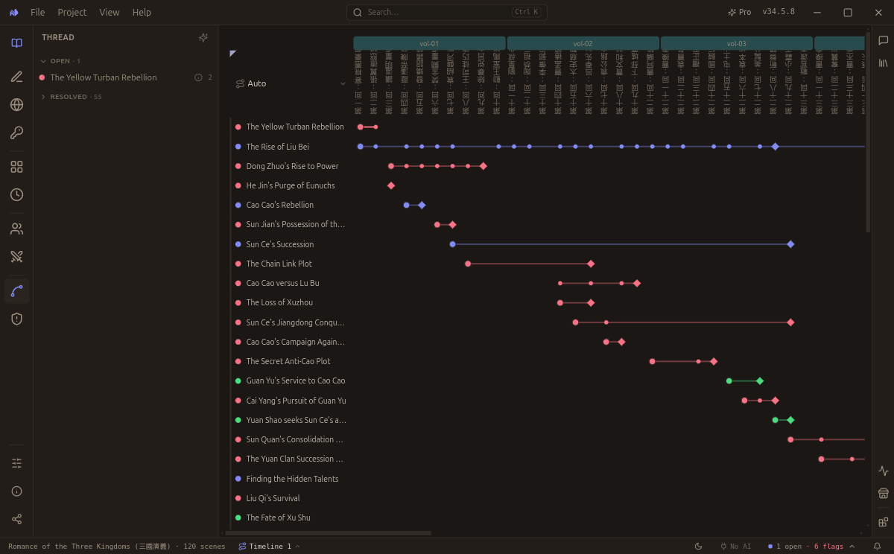
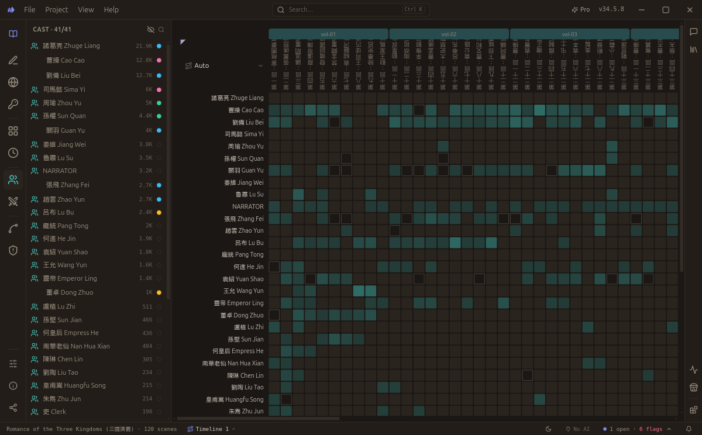
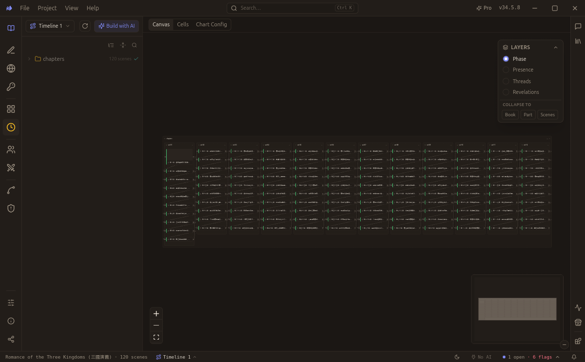
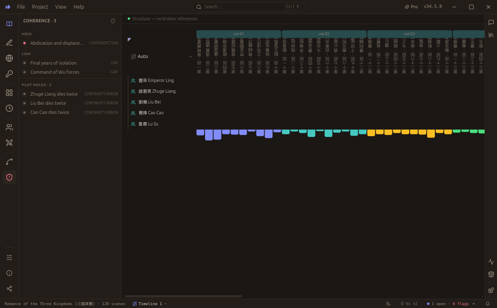

<div align="center">

<picture>
  <source media="(prefers-color-scheme: dark)" srcset="assets/nvs-logo-white.png" />
  
</picture>

# Novel Visual Studio

**A plain-text screenplay studio with an AI reader built in.**
Write dialogue-driven scenes as Markdown; a tireless reader holds the whole story so you don't have to.

[](https://github.com/neldivad/nvs-app/releases/latest)
[](#-linux)
[](#-windows--macos)
[](LICENSE)
[](https://discord.gg/QpggZnAHEY)

[**⬇ Download**](#download) · [Why it exists](#the-idea) · [Product page](https://www.getqed.app/nvs) · [Example works](https://github.com/neldivad/nvs-datasets) · [How you can help](#how-you-can-help)

</div>



> **Status: working alpha.** The editor, the analysis panels (threads · cast · coherence · relationships ·
> timeline · custody), AI extraction, and the Claude MCP plugin are all built and usable. The
> [Fountain](https://fountain.io) format and the on-disk `.nvs/` shape are still settling, so expect rough edges.

---

## Who it's for

The story people make now is **dialogue-shaped, not prose-shaped** — and NVS is built for the people writing it:

- **📖 Novelists & fiction writers** — write scenes in plain Markdown and let the reader keep the books: which
  plot threads are still open, who's drifted from who they were, what a character shouldn't know yet, the beat
  that contradicts chapter two. Keep the plot in the machine's memory, not yours.
- **🎬 Screenwriters** — [Fountain](https://fountain.io) is the native unit, not an export. Scene headings,
  dialogue, and action are first-class, and the same rails (cast presence, relationship arcs, a real timeline)
  work on a feature or a series bible.
- **🎥 AI-video & script creators** — a screenplay is already a video prompt: a shot, a line, an action, a cut.
  Write in Fountain and your work converts to a video-model prompt with almost no translation. Turn a transcript
  or a rough draft into clean, structured scenes an agent (or a generation pipeline) can actually read.

## The idea

**A human can't hold the whole forest, and neither can an agent.** Past a certain size, nobody keeps every open
thread, every character's drift, every unpaid setup in their head — and when a story outgrows the context window,
a straight-through read stops working for a model too. So NVS splits the job the way it actually divides:

- **The AI does the tracking** — reads every scene and keeps ledgers (threads, cast, coherence, reveals),
  surfacing the *one* thing that matters right now.
- **The human does the steering** — rails, a timeline, a relationship graph, jump-to-character: a non-linear
  **map of the story** you navigate to skim, pivot, and drill. The same map lets an agent read a work too large
  to hold in one pass.

That shared surface is also what makes the AI's work **auditable**: open a rail, see who's present, what's
promised, who drifted — and check the machine's account of the story against your own. Same page, same truth.

> The longer version — the vision and the bet underneath it — is in **[VISION.md](VISION.md)**.

## What it does

- **Write in Markdown.** Scenes are dialogue-led `.md` files; a world bible (characters, locations, lore) sits
  alongside. Files are the product — open them in any editor, commit them to git.
- **A reader keeps the books.** The in-process engine reads each scene and keeps ledgers: plot threads (open vs
  paid-off), cast presence over time, coherence (contradictions / drift), and reveals.
- **Ask, don't reread.** Panels answer *what have I left hanging? who knew by now? did she drift from her page?*
  from the ledgers — instant, and (for the deterministic half) free.
- **Local-first & private.** Everything runs on your machine. Analysis lives in a `.nvs/` folder beside your
  story. When AI extraction is enabled, your prose goes to the provider *you* choose (OpenAI / OpenRouter /
  Anthropic / local Ollama) with your own key — the key lives in the OS keychain, never on disk, never through us.

<table>
  <tr><td align="center"><b>Threads over time</b></td><td align="center"><b>Cast presence</b></td></tr>
  <tr><td></td><td></td></tr>
  <tr><td align="center"><b>Timeline</b></td><td align="center"><b>Continuity</b></td></tr>
  <tr><td></td><td></td></tr>
</table>

---

## Download

**NVS is cross-platform.** Linux installers are available now; Windows and macOS are built by the same release
pipeline and publish right here.

### 🐧 Linux

**[⬇ Download the AppImage](https://github.com/neldivad/nvs-app/releases/latest/download/novel-visual-studio-x64.AppImage)** (any distro, no install), then make it executable and run:

```bash
chmod +x novel-visual-studio-x64.AppImage
./novel-visual-studio-x64.AppImage
```

**Debian / Ubuntu (`.deb`):**

```bash
curl -L -o nvs.deb \
  "https://github.com/neldivad/nvs-app/releases/latest/download/novel-visual-studio-x64.deb" \
  && sudo dpkg -i nvs.deb
```

### 🪟 Windows &nbsp;·&nbsp; 🍎 macOS

**Cross-platform and on the way.** The Windows `.exe` and macOS `.dmg` are built by the **same release pipeline**
as the Linux installers — each OS builds on its own cloud runner — and they publish **right here** with an
upcoming release. Click **👀 Watch → Custom → Releases** at the top of this repo, or join the
**[Discord](https://discord.gg/QpggZnAHEY)**, to know the moment your build is up. (Builds are unsigned beta:
Windows shows a SmartScreen warning; macOS opens via right-click → Open.)

### 📚 Start with a real project

The in-app **Store** connects to **[nvs-datasets](https://github.com/neldivad/nvs-datasets)** — a public library
of classics already in NVS format. Download one and it opens with every panel live: no conversion, no waiting.

---

## First prompts to try

NVS ships an AI assistant in the right rail (bring your own model). Open a project — or grab one from the Store —
and paste any of these; wherever a prompt says `[…]`, drop in a name from your story:

- *"What are the main plot threads, and which are still open?"*
- *"Summarize everything that's happened up to chapter 5."*
- *"Are there any continuity errors or plot holes in my draft?"*
- *"Who knows about `[the secret]`, and when did each of them find out?"*
- *"Trace `[character]`'s arc — how do they change across the story?"*
- *"Based on my corkboard, what have I planned but haven't written yet?"*
- *"Turn this text into NVS scenes and character pages."* — for pasting in a draft or transcript.

Anything it proposes to change becomes a **Task** you review first — nothing is applied silently.

---

## Build from source

It's an [Electron](https://www.electronjs.org/) app (Windows · macOS · Linux) with an in-process TypeScript
narrative-analysis engine.

```bash
npm install        # postinstall rebuilds better-sqlite3 for Electron
npm run dev        # launch the app with HMR
npm run build      # typecheck + bundle
npm run dist       # build installers for the current OS (win/mac/linux)
```

Open a project from the welcome screen — point it at the bundled
[`resources/sample-project/`](resources/sample-project/) or download one from
[nvs-datasets](https://github.com/neldivad/nvs-datasets).

```
src/main      Electron main (Node): windows, dialogs, safeStorage, file-watch, IPC
src/preload   contextBridge → window.nvs (the only UI→engine path)
src/engine    the TS narrative engine + app-owned SQL schema
src/shared    ipc.ts — the typed renderer↔main contract
src/renderer  the React SPA (Tailwind v4 · shadcn/ui · Zustand)
DESIGN.md     the visual system (source of truth; pins both light/dark modes)
AGENTS.md     guide for agents building the app
```

## Use NVS from Claude (MCP)

NVS is also a tool an agent can drive over [MCP](https://modelcontextprotocol.io): Claude can **read** your
project, **build** the analysis from Markdown, and — while the app is open — **see** your rails via a screenshot.
It's local (your files never leave your machine). While NVS is open, use **Store → Use with Claude** to copy the
exact `claude mcp add` command (it embeds a per-install token — copy it, don't share it), then in Claude Code:
*"captureView and describe what you see."*

## Companion projects

- **[nvs-parser](https://github.com/neldivad/nvs-parser)** — the converter (transcripts / novels → NVS projects),
  its agentic conversion skills + quality oracle, and the on-disk convention.
- **[nvs-datasets](https://github.com/neldivad/nvs-datasets)** — the public library of example works the in-app
  Store downloads from.

---

## How you can help

NVS is early, and the single most useful thing you can do is **use it and tell us what breaks**:

- 🐛 **Report a bug** — [open an issue](https://github.com/neldivad/nvs-app/issues/new) with what you did and what happened. Even rough reports help.
- 💡 **Suggest / discuss** — [start a discussion](https://github.com/neldivad/nvs-app/discussions) for ideas, questions, or feature requests.
- 🎧 **Join the [Discord](https://discord.gg/QpggZnAHEY)** — ask questions, show your work, help shape the roadmap.
- ⭐ **Star** this repo so other writers find it.
- ✍️ **Just use it** — write something real and tell us how the panels held up. That feedback is worth more than anything.

## License

**[AGPL-3.0](LICENSE)** — free to use, study, modify, and share; if you distribute a modified version or run it
as a network service, you must release your source under the AGPL too. Novel Visual Studio is © 2026 neldivad.
For commercial licensing without AGPL obligations, contact **support@nelworks.com**.

See the [privacy policy](https://www.getqed.app/legal/privacy) and [terms](https://www.getqed.app/legal/terms).
