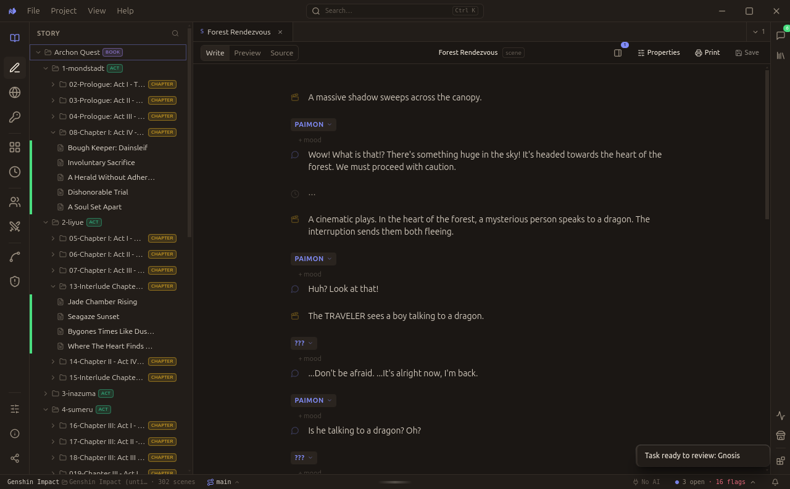
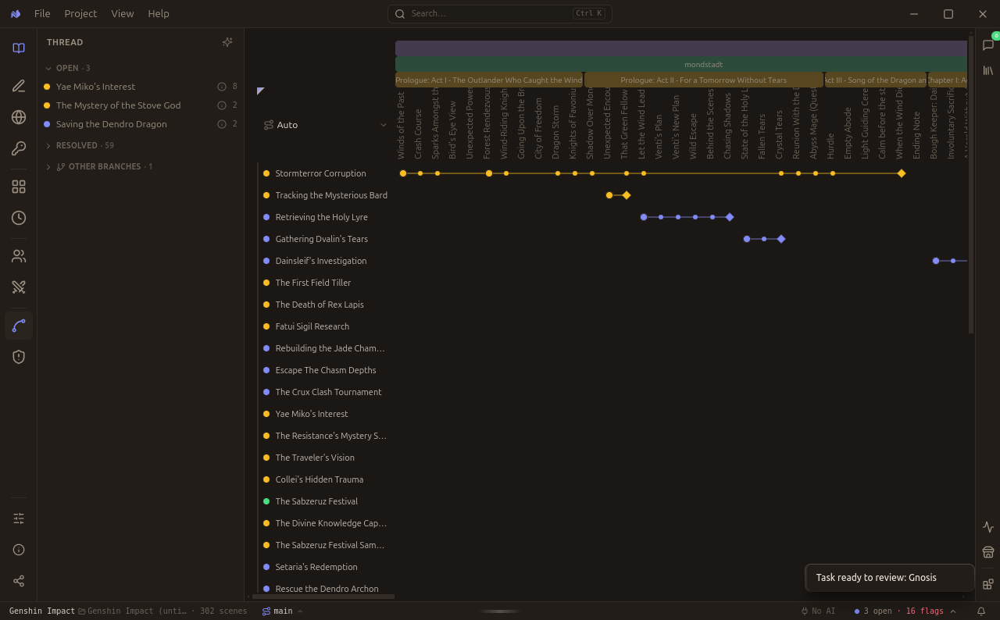
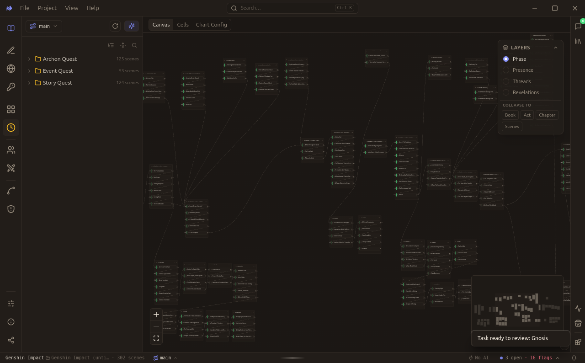
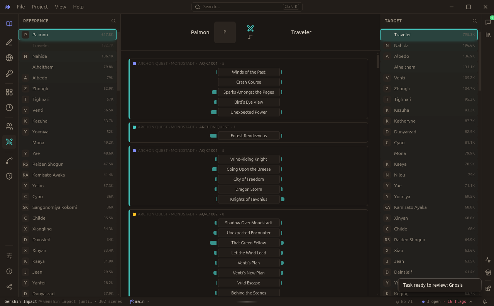
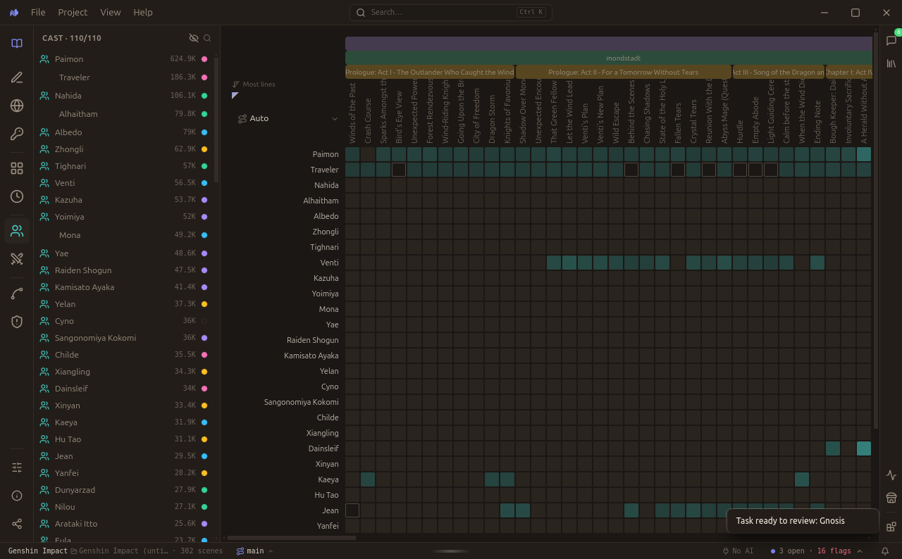
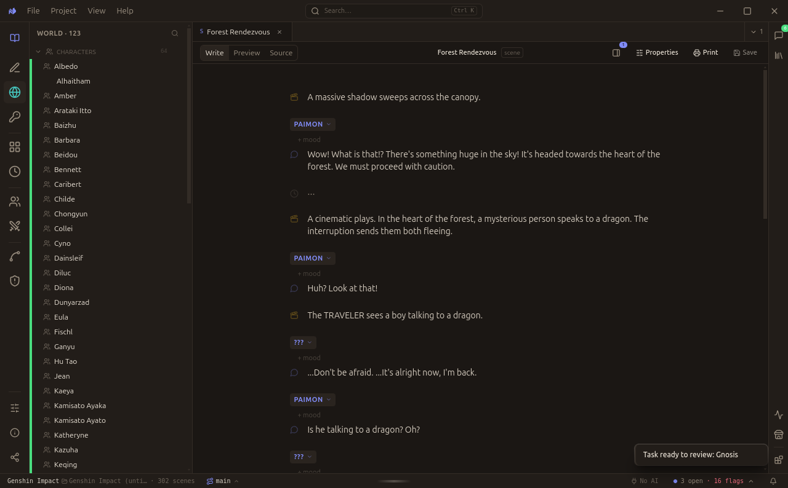
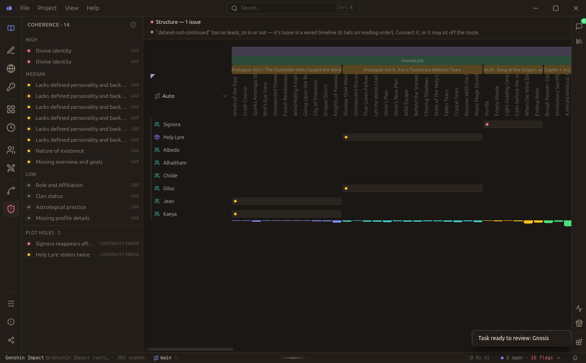
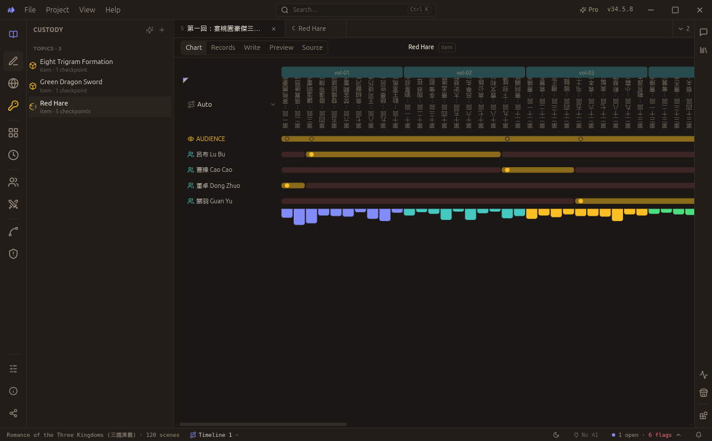
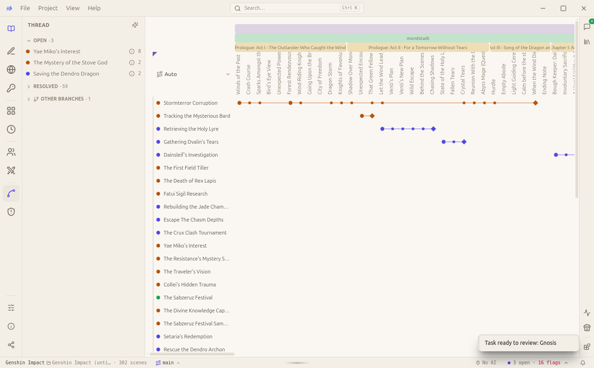

<div align="center">

<picture>
  <source media="(prefers-color-scheme: dark)" srcset="assets/nvs-logo-white.png" />
  
</picture>

# Novel Visual Studio

**A plain-text screenplay studio with an AI reader built in.**
You write the scenes. A tireless little guy in the sidebar holds the entire plot in his head so your brain doesn't have to.

[](https://github.com/neldivad/nvs-app/releases/latest)
[](#-linux)
[](#-windows--macos)
[](LICENSE)
[](https://discord.gg/QpggZnAHEY)

[**⬇ Download**](#download) · [why tho](#the-idea) · [Product page](https://www.getqed.app/nvs) · [Free classics to open](https://github.com/neldivad/nvs-datasets) · [join the discord](https://discord.gg/QpggZnAHEY)

</div>



> **Status: working alpha.** Editor, the analysis rails (threads · cast · coherence · relationships · timeline ·
> custody), AI extraction, and the Claude MCP plugin are all real and usable. The [Fountain](https://fountain.io)
> format and the on-disk `.nvs/` shape are still cooking, so expect the occasional rough edge. we ball anyway.

---

## the problem (you already know this feel)

```text
> be me
> writing my epic 300k-word fantasy saga, absolute cinema
> chapter 3: introduce mysterious hooded stranger, casually drop 6 plot threads
> chapter 41: wait who was the hooded guy?
> does my main character know about the betrayal yet?? or is that next arc
> did I ever pay off the cursed sword thing? Whose child does this belong to? Did I just accidentally made those characters commit incest? 
> open a 4th notepad to keep track of my other 3 notepads
> goodreads review: "plot holes you could drive a truck through"
> MFW i am the truck
```

Past a certain size **nobody** holds the whole forest, every open thread, every character's drift, every unpaid
setup.

There's a reason why most long running series turns bad past season 4. The original writer got fired, finished his contract, and now a new intern inherits the universe and retconns everything.

Redditors will say it is a skill issue when it is a RAM issue. Your head was never the right place to store the plot and your universe's wiki.

## the fix

```text
> download NVS (free, local, no account, no "sign up for our newsletter")
> write scenes in plain markdown like a normal human being
> the little guy in the margin reads everything. never sleeps. never forgets. never asks for a raise
> "yo king, 3 threads still open and Karen is NOT supposed to know about the murder yet"
> continuity errors: caught by you, before they're caught by 400 people on reddit
> mfw the machine holds the plot and my monke brain is finally free
> TFW your audience never complains your "story is so ass". 
```

**Keep the plot in the machine's memory, not yours.** You do the steering (the choices only you can make); the AI
does the tracking (the bookkeeping no human should have to). One does not simply memorize 302 scenes so don't.

> the long, serious, no-memes version of the vision lives in **[VISION.md](VISION.md)** for the intellectuals and man of culture.

## who's this for

The content the world makes now is **dialogue-shaped, not prose-shaped.** NVS is built different for the people
writing it:

- **📖 Novelists & fiction writers**: you write scenes, let the reader track your drafts. Check the threads that was opened, paid-off. Learn which character drifted from who they were. Build suspense or mystery by tracking what a character shouldn't know yet, learn if your most recent chapter has any contradictions you should fix before starting the next.  
- **🎬 Screenwriters** — [Fountain](https://fountain.io) is the *native unit*, not a cursed export. Just write each scene like how you write for a single cut for your film director, with a better UX instead of repeating the shape with Microsoft Word.
- **🎥 AI-video & script creators**: a screenplay is basically already a video prompt (a shot, a line, an action,
  a cut). Write in Fountain and it converts to a video-model prompt with almost no translation. Your export will be a clean, structured scenes an agent can actually read and generate high quality video frames. 
- **Someone who listens to a podcast or interviews**: You think NVS is just a toy for fiction writers? It works on any content shaped like a dialogue. You can use NVS to find out who is talking the most, topics people are getting into, and topics that didn't get closed because the speakers got distracted. This isn't YET how normal people analyzes transcript, but eventually it may be the new way to do it. 

---

## Examples and Showcase

> **every single image below is a live analysis of a real 302-scene _Genshin Impact_ project** (+ one from
> _Romance of the Three Kingdoms_). these are NOT mockups. We don't do Figma impressions, or AI-generate the renderings and artist impression like some Saudi real estate project.

<table>
  <tr>
    <td align="center"><b>Every plot thread, whole story</b><br/><sub>3 open · 59 resolved · 0 forgotten</sub></td>
    <td align="center"><b>An actual timeline of events</b></td>
  </tr>
  <tr>
    <td></td>
    <td></td>
  </tr>
  <tr>
    <td align="center"><b>How two characters relate, scene by scene</b><br/><sub>the ship graph, receipts included</sub></td>
    <td align="center"><b>Who carries the story</b><br/><sub>main-character energy, quantified</sub></td>
  </tr>
  <tr>
    <td></td>
    <td></td>
  </tr>
  <tr>
    <td align="center"><b>A world bible that writes itself</b></td>
    <td align="center"><b>Continuity cop</b><br/><sub>contradictions & drift, found before reddit finds them</sub></td>
  </tr>
  <tr>
    <td></td>
    <td></td>
  </tr>
  <tr>
    <td align="center"><b>Who's holding the MacGuffin, and since when</b><br/><sub>Red Hare: Dong Zhuo → Lü Bu → Cao Cao → Guan Yu</sub></td>
    <td align="center"><b>light mode for the manuscript purists</b></td>
  </tr>
  <tr>
    <td></td>
    <td></td>
  </tr>
</table>

**Custody** — is the "who knows the secret / who's holding the thing" tracker. It's the One Ring, except it's a horse, and NVS never loses track of who has it. 

This is your skill in engineering mystery or suspense.  

## what it does

- **Write in Markdown.** Scenes are dialogue-led `.md` files; a Wiki or Fandom-like folder to track the truth of your characters sits alongside. Files are the product that you can open in ANY editor. Your project don't get lock-in to our ecosystem, and we never rugpull your life's work.
- **A reader keeps the books.** The in-process engine reads each scene and keeps ledgers: threads, cast presence,
  coherence, reveals. This backend produces the magic when you ask AI *what have I left hanging? who knew by now? did she drift?* and you get instant answers.
- **Local-first & private.** Everything runs on your machine. Analysis lives in a `.nvs/` folder next
  to your story. When you turn on AI, your prose goes to the provider **you** pick (OpenAI / OpenRouter /
  Anthropic / local Ollama) with **your** key. Your key lives in the OS keychain, never on disk, never through us.
  we literally do not have a server to spy on you with. it's just you and Claude / GPT / Deepseek.

---

## Download

**NVS is cross-platform**. Linux, Windows, and macOS, all built by the same pipeline (one cloud runner per OS).
All builds are **unsigned beta**, so each OS throws a scary-looking first-run warning you can click past (steps
below). If you think its a virus, trust me bro its not. (it's open source, read the code if you're paranoid.)

### 🐧 Linux

**[⬇ Download the AppImage](https://github.com/neldivad/nvs-app/releases/latest/download/novel-visual-studio-x86_64.AppImage)** (any distro, no install), then:

```bash
chmod +x novel-visual-studio-x86_64.AppImage
./novel-visual-studio-x86_64.AppImage
```

**Debian / Ubuntu (`.deb`):**

```bash
curl -L -o nvs.deb \
  "https://github.com/neldivad/nvs-app/releases/latest/download/novel-visual-studio-amd64.deb" \
  && sudo dpkg -i nvs.deb
```

### 🪟 Windows

**[⬇ Download the installer (.exe)](https://github.com/neldivad/nvs-app/releases/latest/download/novel-visual-studio-x64.exe)**
— SmartScreen will clutch its pearls on first launch: click **More info → Run anyway**.

### 🍎 macOS (Apple Silicon)

**[⬇ Download the .dmg](https://github.com/neldivad/nvs-app/releases/latest/download/novel-visual-studio-arm64.dmg)**
— Gatekeeper blocks the first open: **right-click the app → Open**, then confirm. Apple just being Apple.

### 📚 don't have a project? borrow a classic

Look, we already knew this is gonna happen. Writers block happens when you see a blank screen and you hate your life for not being able to write something. 

The in-app **Store** pulls from **[nvs-datasets](https://github.com/neldivad/nvs-datasets)** and you get classical and popular stories you probably know, already in NVS format. 

Check out stories you already know, like *Alice in Wonderland* or *Journey to the West* and see how the machine read a whole book and how it matched with your experience.

Hopefully, this is enough to convince you the capabilities of NVS and a quick start on how you want to work on YOUR OWN project. 

---

## first prompts to paste into the AI

You might be skeptical with how this AI feature works. This is the "try it and you see" moment. 

For this part, you should at least know how to sign up for an AI API key from Openai, Anthropic, or Openrouter. If you are just a writer, you are not missing out too much on this feature. 

Anyway, bring your own model, open a project, and ask any of these into the right-rail chat (`[…]` = a name from your story):

- *"What are the main plot threads, and which are still open?"*
- *"Summarize everything that's happened up to chapter 5."*
- *"Are there any continuity errors or plot holes in my draft?"*
- *"Who knows about `[the secret]`, and when did each of them find out?"*
- *"Trace `[character]`'s arc. how do they change across the story?"*
- *"Based on my corkboard, what have I planned but haven't written yet?"*
- *"Turn this text into NVS scenes and character pages."* -- paste a raw draft or transcript

Anything it wants to change becomes a **Task** you review first. nothing gets into your files without a "yes".

---

## Build from source (for the tinkerers)

It's an [Electron](https://www.electronjs.org/) app + an in-process TypeScript narrative engine.

```bash
npm install        # postinstall rebuilds better-sqlite3 for Electron
npm run dev        # launch with HMR
npm run build      # typecheck + bundle
npm run dist       # build installers for your current OS
```

```
src/main      Electron main (Node): windows, dialogs, safeStorage, file-watch, IPC
src/preload   contextBridge → window.nvs (the only UI→engine path)
src/engine    the TS narrative engine + app-owned SQL schema
src/shared    ipc.ts — the typed renderer↔main contract
src/renderer  the React SPA (Tailwind v4 · shadcn/ui · Zustand)
```

**Drive it from Claude (MCP).** NVS is also a tool an agent can drive over [MCP](https://modelcontextprotocol.io):
Claude can read your project, build the analysis, and screenshot your rails — all local. In-app: **Store → Use
with Claude**. 

**Companion repos:** 

1. [nvs-parser](https://github.com/neldivad/nvs-parser) (converter + quality oracle). Use this if you have a big pdf or full storybook you are trying to turn into nvs.
2. [nvs-datasets](https://github.com/neldivad/nvs-datasets) (the classics the Store pulls from).

---

## ok you scrolled this far. now WRITE something.

The app is free, the datasets are free, there's no paywall and no sponsor slop. the only thing
we actually want is for you to **use it and share what you make.** that's the whole ask.

1. ⬇️ **grab it** (up there ☝️)
2. 💬 **[join the Discord](https://discord.gg/QpggZnAHEY)** — say hi, ask dumb questions, lurk if you must, I will personally reply to you!
3. ✍️ **write your first scene.** blank project, or paste a transcript, or crack open a classic from the Store and mess with it
4. 📢 **post your first story in the Discord.** three scenes and a fever dream? we want to see it. no story too small, no writer too new. we're all NPCs until chapter one.

that's it. no growth-hack funnel, no "book a demo." just writers and a developer having fun.

**be the main character. ship a story. or transcribe a non-fiction into something you can easily share with your AI** 

## other ways to help

- 🐛 **[report a bug](https://github.com/neldivad/nvs-app/issues/new)** — even a rough "this broke fffffffuuuuu" helps a ton
- 💡 **[start a discussion](https://github.com/neldivad/nvs-app/discussions)** — ideas, feature requests, hot takes
- ⭐ **star the repo** so other writers stumble onto it

## FAQ (the questions you're actually about to ask)

> **"But I don't want AI. I just want to WRITE."**

Good! NVS is a literally made for writers first. We first make a great plain-text writing app with all the features you normally already use. 

We have the editor, the story tree, and half the features
(cast presence, timeline, who's-in-which-scene) are **100% deterministic: zero AI, zero key, zero internet.** 

AI is opt-in and **off by default.** Switch it on only if/when you want the fancy extraction. Or never. we don't care if you use AI or not. We just thought "wouldn't it be cool if I stopped forgetting what I write?" and "hey, maybe this AI thing solves this problem.".

> **"Ok I still don't get it. How do I start in 5 minutes?"**

1. Download from the link ☝️
2. Accept the scary unsigned-app warning (More info → Run anyway / right-click → Open)
3. Start writing. Alternatively, agree to all terms and conditions, then write.

That's genuinely it. Still stuck? Paste this repo's link into ChatGPT/Claude and go *"yo how do I use this on my
pc"* and it'll hand-hold you through it. Living in the future is free.

> **"Is my writing private?"**

Yes. We have **no servers, no funding, and we don't charge you.** There's no backend to leak because there's no
backend. Your prose is plain files on your disk. You get everything free, no catch. You even get the full source
code, so you can literally ask an AI to build you the version *you* want. (turn on AI and your text goes to the
provider **you** pick with **your** key. We don't intercept any data because there is no us to route through.)

> **"WTF is Fountain format?"**

The plain-text screenplay format you learn right before Hollywood employs you. Looks like this:

```text
INT. TAVERN — NIGHT

The place reeks of ale and questionable life choices.

GUAN YU
(hand on his blade)
Say that again. I dare you.

CAO CAO
You wound me. I merely offered you a horse.
```

You write like that because **your director wants you to write like that.** Plot twist: it's now basically the
standard shape for **AI video prompts** too (shot, line, action, cut) — so we might as well ride the trend. one
format, novel → screen → generated video.

> **"Does this work for visual novels?"**

Yes! Branching dialogue, a huge cast, routes, who-knows-what-when. This is literally NVS's home turf.

> **"What is a .nvs file?**

It is nothing special. It contains the JSONs and DB files most machines already understands. We don't hide binaries or DRM within to brick anyone's computer. We wrap it those common files in .nvs because WE THINK you probably won't need those generated artifacts in any other application other than ours, so your project won't surprise you with lots of folders. 

> **"So what *can* I throw at it?"**

Novels, screenplays, visual novels, podcasts, interviews, YouTube scripts, that 3-hour Discord VC you transcribed — anything **dialogue-shaped**. If it's people talking, NVS reads it.

> **"Do I have to pay? what's the catch?"**

$0. No pro tier, no "unlock threads for $9.99," no free trial that ambushes your credit card. It's open source.
The catch is there is no catch. (using the *code* to build a commercial competitor is the one thing the license
blocks -- for that, DM support@nelworks.com or my Twitter inbox. everyone else: just have fun bro.)

> **"Your software is alpha, am I gonna lose my work if it gets taken down?"**

Your writing is **plain markdown files on your own disk.** If NVS explodes and get nuked off the internet tomorrow, your story is
still just files in a folder that open in any editor. The analysis DB is the disposable part, nuke it and it
rebuilds. Your words are never held hostage.

> **"Which AI models does it support?"**

OpenAI, OpenRouter (hundreds of models), Anthropic, or local Ollama if you want it fully offline. Bring your own key (BYOK).

> **"Windows/Mac says it's sketchy??"**

Because it's unsigned beta, not because it's sketchy (it's open source -- read every line yourself or ask Claude to do it). Windows:
**More info → Run anyway.** Mac: **right-click → Open.** 

Code signing costs money we are currently not spending, on account of having none. soon™. This is what we can offer as a free software guy. 

## License

**[AGPL-3.0](LICENSE)** — free to use, study, remix, and share; if you ship a modified version or run it as a
network service, your source goes AGPL too (copyleft gang). © 2026 neldivad. Want it *without* the AGPL strings
for a commercial thing? → **support@nelworks.com** or DM my Twitter.

[privacy](https://www.getqed.app/legal/privacy) · [terms](https://www.getqed.app/legal/terms)
